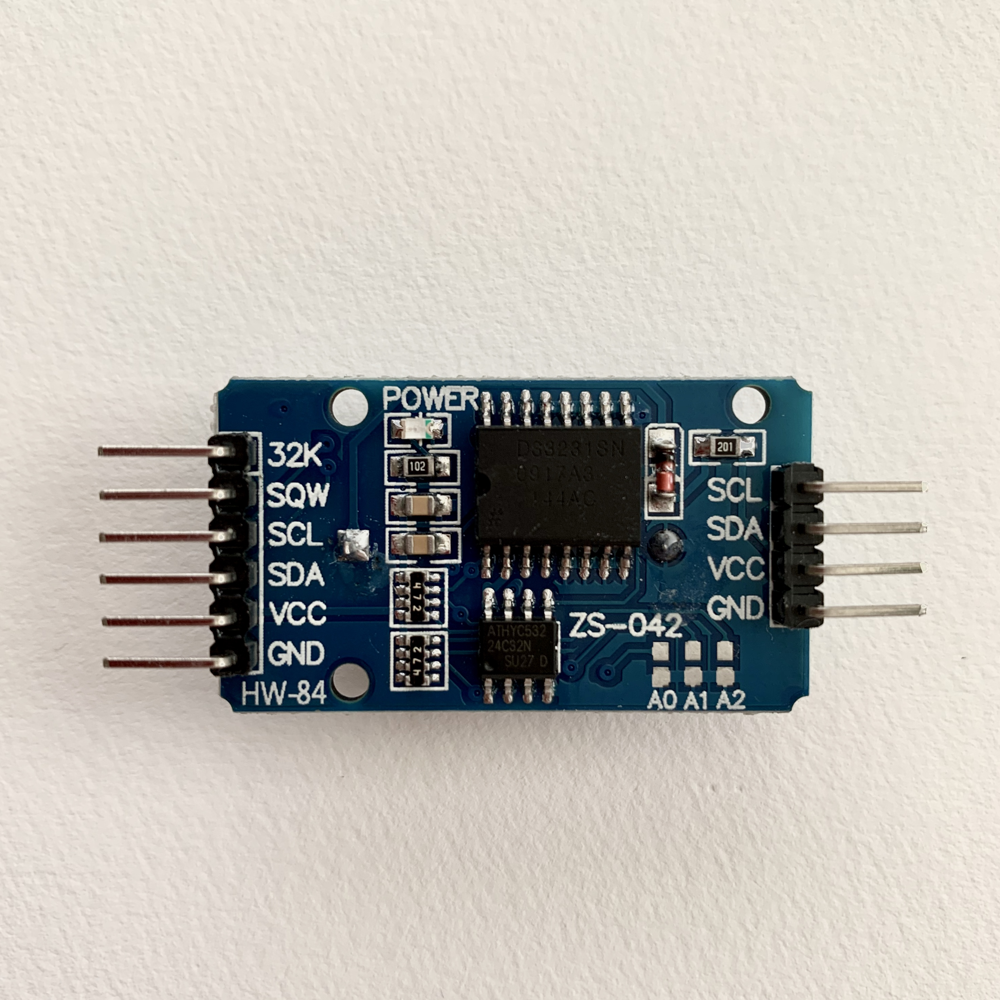
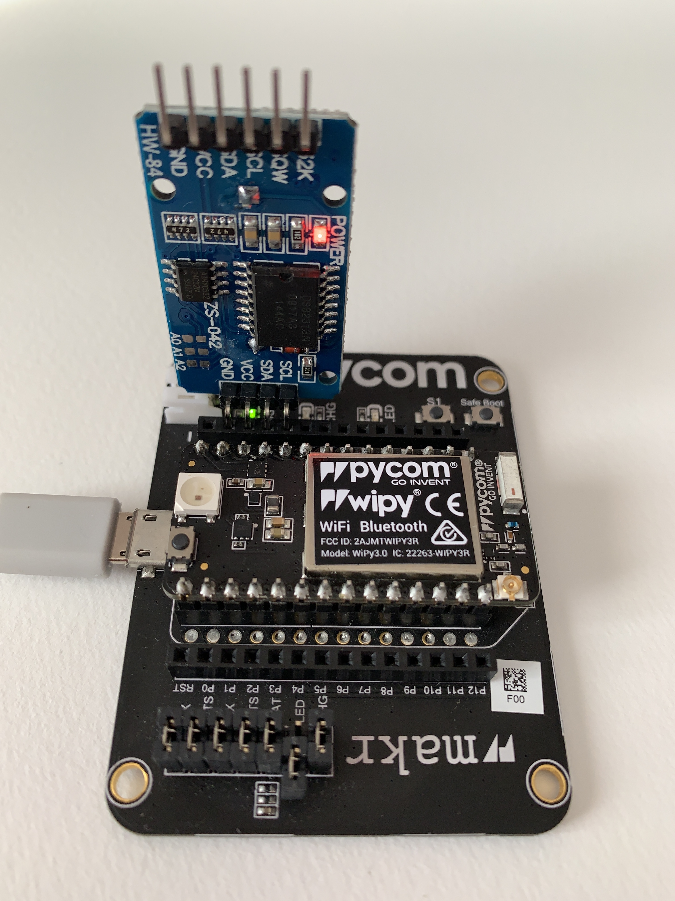

# DS3231-RTC

In this project I show you how to easily use a DS3231 I²C real-time clock (RTC) with your Pycom board (WiPy, LoPy, etc.) when no internet connection is permanently available for syncing the internal RTC. The DS3231 is a low-cost, extremely accurate I²C real-time clock (RTC) with an integrated temperature-compensated crystal oscillator (TCXO) and crystal. The device incorporates a battery input and maintains accurate timekeeping when the main power to the device is interrupted.

The application uses the DS3231 or the internet to set the time on your Pycom board. 

Here it is the DS3231 module I used and how to connect it to the Pycom Expansion Board:

More info at [mindeon.com](https://mindeon.com/posts/coding-journal/pycom-ds3231-rtc/)
