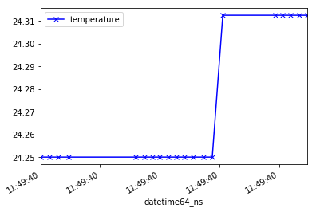

# Meerkat - A Data Acquisition Library for Raspberry Pi and MicroPython

### Features  

* Pure Python API to I2C devices
* Raspberry Pi and MicroPython - code written on one platform will run on the other without modification.  
* Data output to .csv with JSON header or just JSON
* Parser to convert .csv to Pandas DataFrame
* Standardized timestamps and timestamp parsing  
* Metadata description of devices in JSON
* Object oriented class structure allows easy REPL method use
* Base methods separated from device drivers for reusability and extension

### Requirements  
Raspberry Pi 3 - Python 3, Jupyter and Pandas.
MicroPython - Only larger memory microcontrollers such as the FiPy and OpenMV M7 are supported.

### Examples  

Refer to the examples directory for detailed Jupyter Notebook examples

ADS1115 Analog to Digital Converter Setup:
```
dev = ads.ADS1115(bus_n=1)
dev.get_config()
dev.pga('6.144')  # Other options: '6.144', '4.096'
dev.mux('1G')     # pin 1 relative to ground
dev.get_config()  # refresh for measurements
dev.print_attributes()
```
Output:
```
ADS11x5 Configuration Attributes
--------------------------------
Config Register: 20736 0x5100 0b101000100000000
PGA Range: +/- 6.144 Volts
Mode: single
Data Rate: 8 SPS
Input Multiplexer: 1G
Comparator:
 Queue: 1
 Latching: off
 Polarity: Active 1
 Mode: trad
```

ADS1115 Burst Collection Setup:
```
dev.get(description='ADS1115_example_1', n=5)
```
Output:
```
[['ADS1115_example_1', 1, 5, 2.0488125],
 ['ADS1115_example_1', 2, 5, 2.0488125],
 ['ADS1115_example_1', 3, 5, 2.0488125],
 ['ADS1115_example_1', 4, 5, 2.0488125],
 ['ADS1115_example_1', 5, 5, 2.0488125]]
```

MCP9808 Temperature Sensor Setup:
```
mcp = mcp9808.MCP9808(bus_n=1)
mcp.writer.path = 'MCP9808_example.csv'
mcp.write(description='MCP9808_example_2', n=20, delay=None)
m, df = parser.csv_resource(mcp.writer.path)
df.datetime64_ns = df.datetime64_ns.dt.tz_localize('UTC')  # Pandas 0.24.1 hack
df[['datetime64_ns', 'temperature']].plot(x='datetime64_ns', style='-xb');
```
Output Plotted:  


MPU6050 Setup:  
```
dev = mpu6050.mpu6050(bus_n=1, output='json')
dev.set_gyro_range(dev.GYRO_RANGE_1000DEG)
dev.set_accel_range(dev.ACCEL_RANGE_2G)
dev.get_accel_data()
```  
Output:  
```
{'x': 19.6133, 'y': 3.883395092773437, 'z': 8.80347950439453}
```  
MPU6050 Burst All:
```
dev.get_all_burst(description='example_1', n=2)
```

Output:
```
[{'accel_data': {'x': 19.6133,
   'y': 3.8953661010742184,
   'z': 8.805873706054687},
  'arange': 0,
  'desc': 'example_1',
  'grange': 16,
  'gyro_data': {'x': -6.129770992366412,
   'y': -5.061068702290076,
   'z': 6.137404580152672},
  'n': 1,
  'temp_C': 24.059411764705885},
 {'accel_data': {'x': 19.6133, 'y': 3.919308117675781, 'z': 8.865728747558594},
  'arange': 0,
  'desc': 'example_1',
  'grange': 16,
  'gyro_data': {'x': -6.320610687022901,
   'y': -4.984732824427481,
   'z': 5.977099236641221},
  'n': 2,
  'temp_C': 24.012352941176474}]
```
